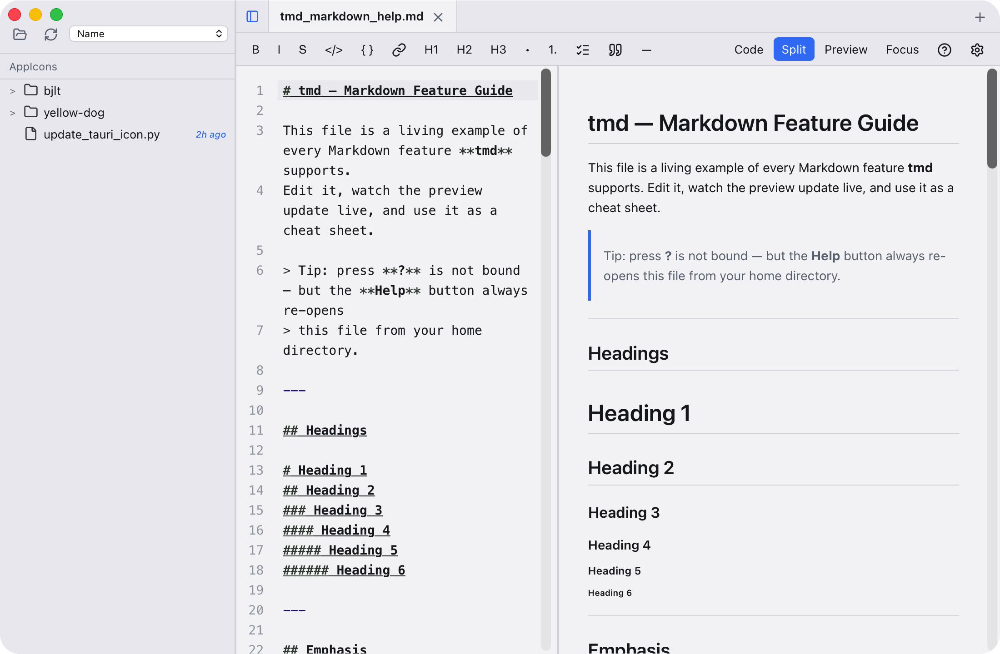

<div align="center">
  
  <h1>tmd</h1>
  <p>A native <strong>Tauri 2 + React 19 + TypeScript</strong> Markdown editor for macOS,<br/>
  built for the workflow where a human and an AI agent edit the same <code>.md</code> file.</p>
</div>

> `tmd` is short for **TONy Markdown**.

> ⚠️ **macOS: "tmd" is damaged and can't be opened — You should move it to the Trash.**
> This is a Gatekeeper / quarantine block, **not** a corrupted file. The app is
> ad-hoc signed (no Apple Developer ID / notarization), so when it arrives from
> another machine it carries the `com.apple.quarantine` extended attribute and
> macOS refuses to launch it. Fix it once with:
>
> ```bash
> sudo xattr -rd com.apple.quarantine /Applications/tmd.app
> ```
>
> Or, if you installed it elsewhere, run the same command with the real path
> (e.g. `~/Downloads/tmd.app`). After this, double-clicking the app works as
> normal. See [Troubleshooting](#troubleshooting) for alternatives.

---



> The screenshot shows the "Split" view: file browser on the left, CodeMirror editor in the middle, and the live preview on the right.


## Table of Contents

- [Features](#features)
- [Tech Stack](#tech-stack)
- [Requirements](#requirements)
- [Install & Run](#install--run)
- [Build & Package](#build--package)
- [Configuration](#configuration)
- [Usage Examples](#usage-examples)
- [Project Structure](#project-structure)
- [Troubleshooting](#troubleshooting)
- [Changelog](#changelog)
- [License](#license)

---

## Features

### Editor (CodeMirror 6)

- **Markdown syntax highlighting** — GFM parsing via `@codemirror/lang-markdown`, with embedded language recognition inside fenced code blocks (`@codemirror/language-data`).
- **Line numbers** — toggleable in Settings.
- **Per-tab undo/redo history** — switching tabs never loses the undo stack of other tabs.
- **Bracket matching, line wrapping, Tab-to-indent** and other standard CodeMirror behaviors.
- **Git Gutter** — the left gutter marks lines that differ from the `git HEAD` baseline (added / modified / removed); for untracked files it compares against the saved content on disk.
- **Smart formatting toolbar (toggle actions)** — bold / italic / strikethrough / inline code / code block / link / H1–H6 / bullet list / ordered list / task list / blockquote / horizontal rule. Clicking the same button again reverses the formatting.
- **Reliable clipboard across all surfaces** — copy / cut / paste work correctly in the editor, in native input fields (e.g. the Open from Path / Open from URL dialogs), and on text selected in the live preview. Selecting prose in the preview and pressing ⌘C copies that selection (not the editor's), and a single ⌘V gesture never inserts text twice.

### Live Preview

- **GFM rendering** (`marked`) **+ DOMPurify sanitization** for safe rendering of arbitrary Markdown.
- **Task-list checkboxes** keep their interactive attributes.
- **Local images are inlined as base64 data URIs** — no `local-resource://` protocol exposed, no WebView cross-origin issues.
- **Mermaid diagrams** — ```` ```mermaid ```` code blocks render into zoomable, pannable, PNG-exportable interactive figures; wheel-zoom, drag-to-pan, and dark-mode aware. A **Show code** toggle on each figure flips between the rendered diagram and its raw source.
- **External links open in the system browser**; internal anchors and relative `.md` links use default behavior.
- **Proportional editor ↔ preview scroll sync**, cooldown-guarded to avoid jitter.

### Files & Folders

- **Sidebar file browser**: tree expand/collapse, sorting (name / modified newest-oldest / created newest-oldest), optional modification dates.
- **Right-click menu**: Open / Reveal in Finder / Rename / Move to Trash / Add or Remove Favorite / New File Here / New Folder Here.
- **Favorites** — pin any file or folder to the top of the sidebar.
- **Resizable sidebar**, toggle to collapse/expand.
- **Open from URL (⌘⇧U)** — paste an `http(s)` link (e.g. a GitHub gist raw URL) to fetch its Markdown into a new tab; the tab keeps a link indicator and Save defaults to the original filename.
- **Drag & drop** — drop one or more `.md` files anywhere in the window to open them as tabs; dragging over the editor or preview highlights the drop target.
- **Session persistence** — on relaunch automatically restores open files, the active tab, the current folder, and the last window position & size.

### Tabs

- **New (⌘N) / Close (⌘W)**, middle-click a tab to close it.
- **Dirty indicator (●)** — unsaved edits are obvious at a glance.
- Each tab owns its own CodeMirror `EditorState`, so undo/redo stays isolated.

### Multi-Window

- **⌘⇧N opens a new window**, each with an independent session (tab set + current folder).
- Window position and size persist under `~/Library/Application Support/bid.adaq.tmd/` (macOS), `~/.local/share/bid.adaq.tmd/` (Linux), or `%APPDATA%/bid.adaq.tmd/` (Windows).

### Three-Way Merge (DiffView)

When a file is **modified on disk by an external process** while the current tab has unsaved edits, a DiffView pops up:

- **Per-conflict (hunk) selection**: keep "Mine" (editor's current content) or "Theirs" (the disk's latest content).
- **Bulk buttons**: "Keep Mine", "Keep Theirs", or "Apply Merge" (builds the merged result from the per-hunk choices).
- If the current tab is **not dirty**, the external change is silently merged into the document and the CodeMirror view is refreshed.

### Save & Export

- **Save (⌘S)** / **Save As (⌘⇧S)** / **Duplicate** the current tab.
- **Export PDF** — via the native WebView print dialog (Save as PDF).
- **Export HTML** — renders to a standalone HTML file with inlined styles.
- **Auto-save** — idle save delay selectable from 1s / 2s / 5s / 10s.

### Text Transforms

- **Unicode variants**: italic, bold, bold-italic, monospace.
- **Small Caps** and **Unicode strikethrough**.
- **UPPERCASE / lowercase / Title Case**.
- With text selected, trigger from the menu `Edit → Text Transforms`; the selection is replaced in place.

### Settings

| Group      | Options                                                                                                                                                 |
| ---------- | ------------------------------------------------------------------------------------------------------------------------------------------------------- |
| Appearance | Theme (System / Light / Dark), Accent color (7 choices), Editor font size (11–20), Editor font (6 mono choices), Preview font (6 choices), Line numbers |
| Editing    | Auto-save toggle, Auto-save delay, Show file dates in browser                                                                                           |
| Advanced   | Global hotkey toggle (default `⌘⇧Space` opens the "Open from Path" dialog), Beta update channel                                                         |

### App Shell

- **macOS native menu bar**: `tmd / File / Edit / View / Window / Help`, with full keyboard shortcuts (see below).
- **Recent files & directories**: auto-recorded up to 15 entries, reachable from the menu or the sidebar.
- **Deep linking**: `tmd://open?path=/abs/path&line=42` opens a file and jumps to a line; works on cold launch and via single-instance forwarding.
- **Global hotkey**: with the app unfocused, press `⌘⇧Space` (configurable) to pop up a path box and quickly open any Markdown.
- **In-app updates** (Tauri Updater): when a new GitHub Release is detected, a dialog offers to update now or later.

### Security Model

- **Path allowlist**: only paths under the user's `$HOME` and `/Volumes` are accessible.
- **Path denylist**: `.ssh`, `.gnupg`, `.gpg`, `.aws`, `.docker`, `.kube`, `.config/gcloud`, `.config/gh` — enforced **uniformly** for both IPC and deep links.
- **External-link scheme allowlist**: only `http://` / `https://` / `mailto:` are allowed.
- **Local images use base64 data URIs**, no WebView protocol handler required.

### Keyboard Shortcuts

| Action                            | Shortcut |
| --------------------------------- | -------- |
| New File                          | ⌘N       |
| New Window                        | ⌘⇧N      |
| Open File                         | ⌘O       |
| Open Folder                       | ⌘⇧O      |
| Open from Path                    | ⌘⇧P      |
| Open from URL                     | ⌘⇧U      |
| Save                              | ⌘S       |
| Save As                           | ⌘⇧S      |
| Close Tab                         | ⌘W       |
| Close Window                      | ⌘⇧W      |
| Undo / Redo                       | ⌘Z / ⌘⇧Z |
| Select All                        | ⌘A       |
| Copy Selection (with path prefix) | ⌘⌥C      |
| Find in Folder                    | ⌘⇧G      |
| Focus Mode                        | ⌘⇧F      |
| Reload / Force Reload             | ⌘R / ⌘⇧R |
| Toggle DevTools                   | ⌘⇧I      |
| Minimize                          | ⌘M       |

---

## Tech Stack

### Frontend (`src/`)

- **React 19** + **TypeScript ~7.0** + **Vite 8**
- **CodeMirror 6**: `@codemirror/commands`, `@codemirror/lang-markdown`, `@codemirror/language`, `@codemirror/language-data`, `@codemirror/search`, `@codemirror/state`, `@codemirror/view`, `@lezer/highlight`
- **State management**: [`zustand`](https://github.com/pmndrs/zustand) 5, split into three bounded contexts — **App shell / Tabs / File browser**
- **Markdown**: [`marked`](https://marked.js.org/) 18 + [`DOMPurify`](https://github.com/cure53/DOMPurify)
- **Diagrams**: [`mermaid`](https://mermaid.js.org/) 11
- **Icons**: [`lucide-react`](https://lucide.dev/)
- **Diffing**: [`diff`](https://github.com/kpdecker/jsdiff)

### Backend (`src-tauri/`)

- **Tauri 2** (with `macos-private-api` enabled)
- Plugins:
  - `tauri-plugin-opener` (external links)
  - `tauri-plugin-dialog` (native save/open dialogs)
  - `tauri-plugin-deep-link` (`tmd://` protocol)
  - `tauri-plugin-updater` (in-app updates)
  - `tauri-plugin-global-shortcut` (system-wide shortcuts)
  - `tauri-plugin-single-instance` (single instance + argv forwarding)
- Helper crates: `notify` 6 (file watching), `dirs` 5 (system paths), `trash` 5 (send to Trash), `base64` 0.22 (image inlining)

---

## Requirements

| Tool                     | Recommended                                                                         |
| ------------------------ | ----------------------------------------------------------------------------------- |
| Node.js                  | ≥ 20                                                                                |
| pnpm                     | ≥ 9                                                                                 |
| Rust toolchain           | stable (`rustup default stable`)                                                    |
| macOS                    | 10.15+ (the project is macOS-optimized; the bundler and private API are macOS-only) |
| Xcode Command Line Tools | `xcode-select --install`                                                            |

> Tauri can also build & run on Linux/Windows, but `tauri.conf.json` enables `macOSPrivateApi` and `scripts/bundle.sh` is macOS-only.

---

## Install & Run

```bash
# 1. Clone
git clone https://github.com/tonywxx/tmd.git
cd tmd

# 2. Install frontend dependencies
#    (postinstall automatically patches + verifies the Tauri CLI signature)
pnpm install

# 3. Start dev mode (Vite + Tauri; launches a native window with HMR)
pnpm tauri dev
```

A native window opens at `http://localhost:1420`.

### Alternative run path (bypass the Tauri CLI)

In restricted sandboxes (e.g. CI/automation) the `tauri` CLI process may be SIGKILLed; use the bundled script to build and run directly:

```bash
pnpm build                                       # frontend tsc + vite build
(cd src-tauri && cargo build --release --features custom-protocol)
exec ./src-tauri/target/release/tmd
```

Or in one step:

```bash
bash scripts/run.sh
```

---

## Build & Package

### Preferred: `pnpm tauri build`

The Tauri CLI validates the config, compiles the frontend and the Rust binary, and produces an `.app` / `.dmg` under `src-tauri/target/release/bundle/`.

### Fallback: manual bundling

When the CLI cannot run, use the bundling script:

```bash
pnpm build                                                          # build frontend into dist/
(cd src-tauri && cargo build --release --features custom-protocol)  # compile and embed the frontend
bash scripts/bundle.sh                                              # assemble the .app (Info.plist + icon + ad-hoc sign)
```

Output: `src-tauri/target/release/bundle/macos/tmd.app`.

---

## Configuration

### User settings (editable at runtime)

Open **Settings** from the menu or the gear icon at the top-right of the toolbar. Every change applies immediately (the UI reacts and the file is written at once); **Cancel** reverts everything back to the state the dialog had when it opened, and **Done** just closes it. Settings are persisted to:

- macOS: `~/Library/Application Support/bid.adaq.tmd/settings.json`
- Linux: `~/.local/share/bid.adaq.tmd/settings.json`
- Windows: `%APPDATA%/bid.adaq.tmd/settings.json`

Session state is persisted separately per window label (`main`, `main-2`, …).

### Tauri config (`src-tauri/tauri.conf.json`)

- `productName` / `identifier` — app metadata.
- `app.windows` — the main window (`main`, 1100×720) and the export window (`export`, 820×1040).
- `plugins.deep-link.schemes` — registers the `tmd://` protocol.
- `plugins.updater.endpoints` — defaults to `https://github.com/tonywxx/tmd/releases/latest/download/latest.json`; **replace `pubkey` with a real Tauri updater key** before your first release (see the Tauri Updater docs).

### Path allowlist

To adjust which paths are reachable, edit `src-tauri/src/security.rs`:

- `DENY_SUBPATHS` — the list of sensitive directories that are blocked.
- `is_path_allowed` — the allow-root (`$HOME` + `/Volumes`).

---

## Usage Examples

### 1. Create and save a Markdown file

1. Press **⌘N** to open a new tab and start writing.
2. Press **⌘S** (a never-saved tab always triggers "Save As") to choose a path; afterward **⌘S** overwrites normally.

### 2. Pre-fill with an AI script and open

```bash
# Any script writes content to a tmd-allowed path
echo "# Hello" > ~/notes/hello.md

# Open it via deep link, jumping to line 1
open "tmd://open?path=$HOME/notes/hello.md&line=1"
```

### 3. Search in a folder

Press **⌘⇧G** to open "Find in Folder":

- Enter a keyword, optionally case-sensitive;
- Click a result to open the file and jump to that line.

### 4. Resolve a conflict from an external edit

When `git pull`, an AI script, or another editor changes a file you have open with unsaved edits, **DiffView** appears automatically:

- For each conflict, click "Use Mine" or "Use Theirs";
- Or use the bulk "Keep Mine" / "Keep Theirs" / "Apply Merge" buttons.

### 5. Save a Mermaid diagram as PNG

Write a ```` ```mermaid ```` code block; once it renders in the preview, click the download icon in the figure's top-right toolbar to save a `.png`.

### 6. Open files with the global hotkey

In **Settings → Advanced**, enable "Enable global hotkey". Even when tmd is not focused, press `⌘⇧Space` (default) to pop up a path box; hit Enter to open and jump to the file.

### 7. Focus Mode for distraction-free writing

Press **⌘⇧F** to toggle **Focus Mode**: the sidebar, tab bar, and toolbar are hidden, leaving only the editor.

---

## Project Structure

```
tmd/
├── src/                          # Frontend (React + TypeScript)
│   ├── App.tsx                   # App shell: event wiring, panel layout, command mapping
│   ├── main.tsx                  # React entry + startup error fallback
│   ├── index.css                 # Theme & global styles
│   ├── components/
│   │   ├── Editor.tsx            # CodeMirror instance mgmt (per-tab state)
│   │   ├── Preview.tsx           # Render + Mermaid + scroll sync
│   │   ├── FileBrowser.tsx       # Sidebar + favorites + tree + context menu
│   │   ├── TabBar.tsx            # Tabs
│   │   ├── WorkspaceToolbar.tsx  # Format toolbar + view switch + Help/Settings
│   │   ├── Icon.tsx              # Icon wrapper
│   │   └── dialogs/              # Settings / About / DiffView / Find / OpenPath / OpenUrl / Update / Toasts
│   └── lib/
│       ├── bridge.ts             # Typed IPC wrappers
│       ├── commands.ts           # Command registry
│       ├── appCommands.ts        # Command implementations (docs, edit, window, shell)
│       ├── fs.ts                 # File-system seam (incl. InMemoryFileSystem test double)
│       ├── persist.ts            # Tab persistence (Save / SaveAs / Merge / External)
│       ├── formatActions.ts      # Markdown toggle formatting
│       ├── textTransforms.ts     # Unicode / case transforms
│       ├── markdown.ts           # marked + DOMPurify
│       ├── mermaid.ts            # Mermaid render + SVG→PNG
│       ├── mermaidFigure.ts      # Interactive figure (zoom/pan/download)
│       ├── diff.ts               # Three-way merge builder
│       ├── dragDrop.ts           # Window-wide .md drag & drop → tabs
│       ├── editorPort.ts         # Tab-agnostic editor operation port
│       ├── scrollSync.ts         # Editor ↔ preview scroll sync
│       ├── pathutil.ts           # Cross-platform path helpers
│       ├── store.ts              # zustand root store (composes 3 slices)
│       ├── state/                # shellSlice / tabsSlice / fileBrowserSlice
│       └── types.ts              # Domain model mirrored from Rust
│
├── src-tauri/                    # Backend (Rust)
│   ├── src/
│   │   ├── lib.rs                # Tauri bootstrap, menu, single-instance, window events
│   │   ├── commands.rs           # All #[tauri::command] implementations
│   │   ├── security.rs           # Path / scheme / image-extension allowlists
│   │   ├── watcher.rs            # notify file/directory watching
│   │   ├── git.rs                # git HEAD baseline
│   │   ├── store.rs              # Persistence (settings + session)
│   │   └── types.rs              # Types mirrored from TS
│   ├── tauri.conf.json
│   ├── Cargo.toml
│   ├── capabilities/             # Tauri permission declarations
│   └── icons/
│
├── scripts/
│   ├── run.sh                    # Build + run the release binary directly
│   ├── bundle.sh                 # Manually bundle into .app
│   ├── patch-tauri-cli.mjs       # postinstall: patch the Tauri CLI
│   └── fix-tauri-cli-signature.sh
│
├── docs/
│   ├── agents/                   # Project docs referenced by AGENTS.md
│   └── adr/                      # Architecture Decision Records (7)
│
├── CONTEXT.md                    # Project glossary & invariants (single source)
├── config.schema.json            # JSON Schema for the Tauri config
├── img/                          # README assets (logo, screenshots)
├── package.json
├── pnpm-workspace.yaml
└── vite.config.ts
```

---

## Troubleshooting

### "tmd" is damaged and can't be opened — You should move it to the Trash

This is the most common macOS issue and is **not** a corrupted download. tmd is
ad-hoc signed (built with `codesign --force --deep --sign -`, see
`scripts/bundle.sh`) and is **not** notarized with an Apple Developer ID. When the
`.app` is copied from another Mac or downloaded from the internet, macOS tags it
with the `com.apple.quarantine` extended attribute, and Gatekeeper blocks the
launch with the "damaged" dialog.

**Easiest fix — strip the quarantine attribute:**

```bash
sudo xattr -rd com.apple.quarantine /Applications/tmd.app
```

(Replace the path if you installed tmd somewhere else, e.g. `~/Downloads/tmd.app`.)
After running this once, double-clicking the app launches it normally.

**Alternative fix — open once via the context menu:**

1. In Finder, right-click (or Control-click) `tmd.app`.
2. Choose **Open** from the menu.
3. In the confirmation dialog, click **Open**.

macOS remembers this approval and subsequent launches work normally. This path
does not require Terminal or `sudo`.

> **Why not just "Move to Trash"?** The dialog's suggestion is misleading for
> ad-hoc-signed open-source apps. The binary is intact; only the quarantine flag
> blocks it. Removing the flag (above) is the supported workaround and does not
> weaken your Mac — the app still runs inside the sandbox defined by its Tauri
> capabilities.

### App won't start in `pnpm tauri dev` (CLI killed instantly)

In some sandboxes the harness SIGKILLs the `tauri` CLI process tree (and its
`cargo` child), so `pnpm tauri dev` / `pnpm tauri build` die with no error. The
compiled binary itself runs fine when launched directly. Use the bundled script:

```bash
bash scripts/run.sh
```

This builds the frontend + backend and `exec`s the release binary directly,
bypassing the Tauri CLI.

### No native window / WebView in headless environments

tmd needs a WindowServer to render its UI. On a headless CI machine `pnpm tauri
dev` will build but show nothing. Run it on a desktop Mac (or any environment
with a display) to see the window.

---

## Changelog

Full release history in both English and 中文: [CHANGELOG.md](./CHANGELOG.md).

---

## License

[Apache License 2.0](./LICENSE)
